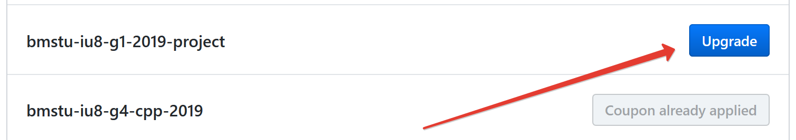
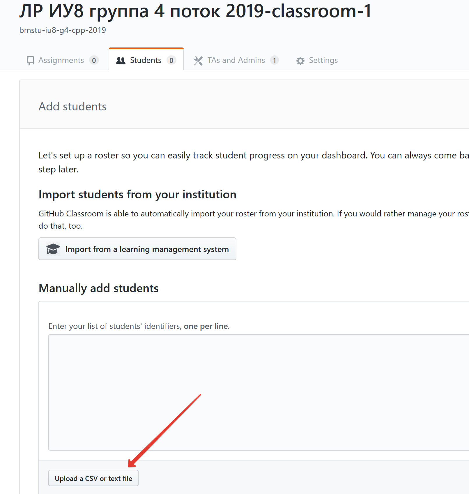
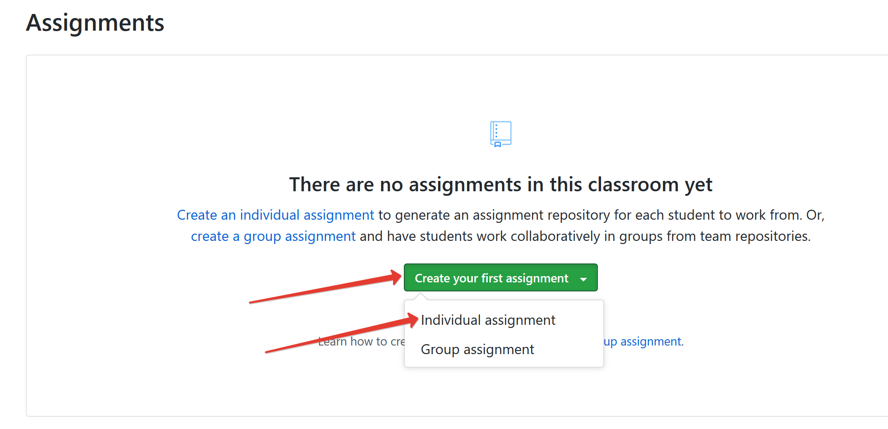
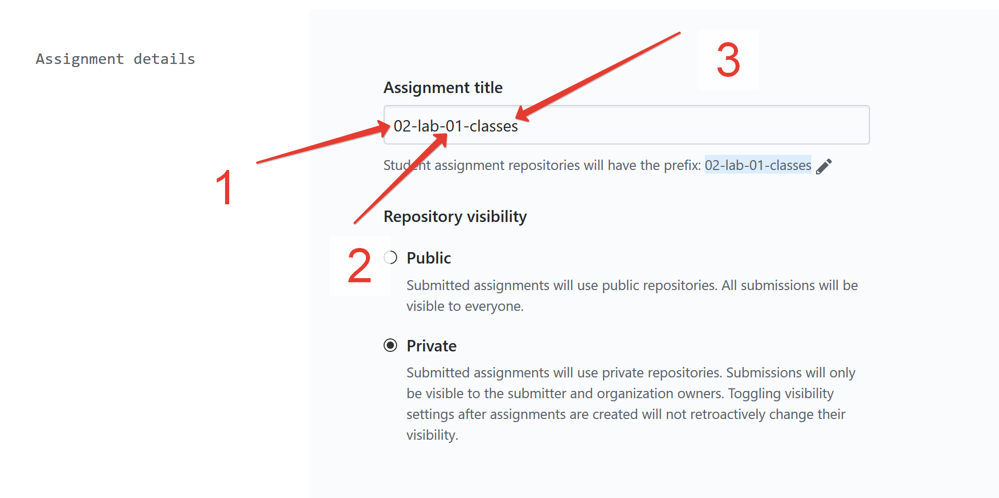
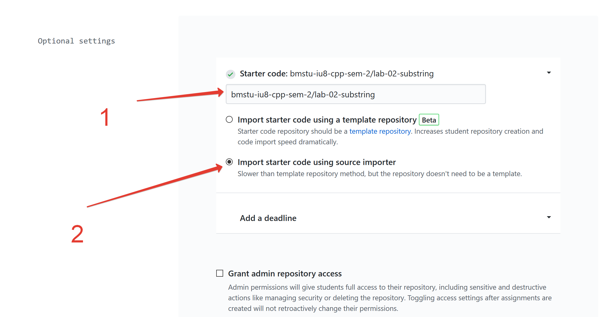
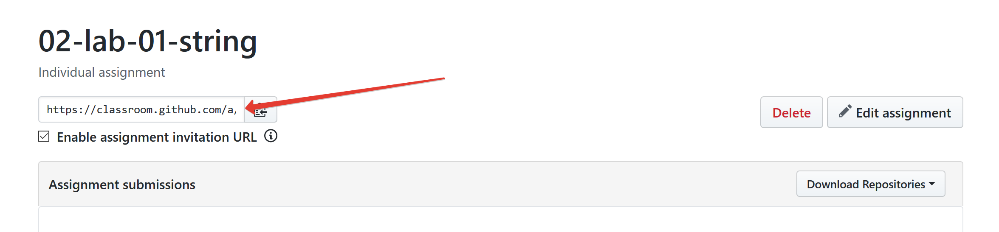
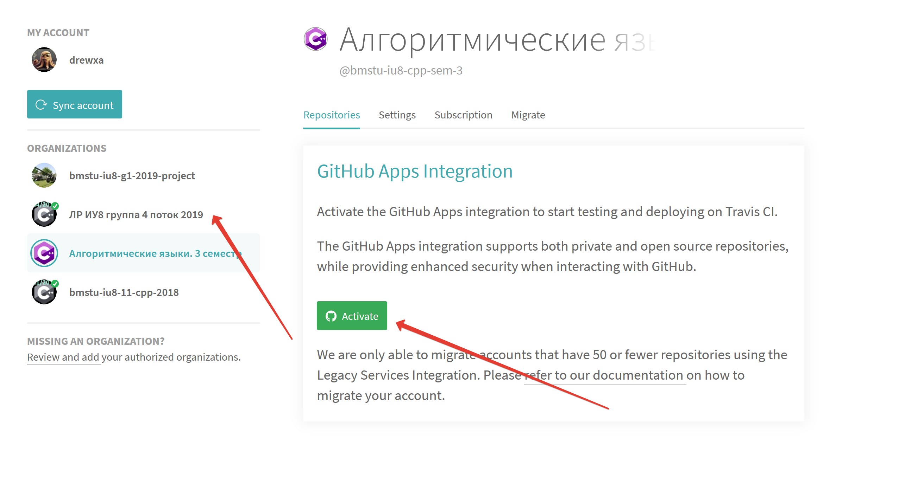

# Tutorial для преподавателей

Ниже с картинками попробуем рассказать как заехать в систему classroom, github, travis ci.

## Краткое описание
Система такая:
1. студент получает ссылку
2. при переходе по ссылке создается приватный (чтобы не списывали) репозиторий, который видит преподаватель и студент
3. студент локально выполняет задание в отдельной git-ветке
4. студент пушит (`git push`) локальную ветку в репозиторий, созданный в пункте 2
5. студент создает pull-request (далее PR) из своей ветки в master
6. на PR запускаются автоматические проверки: соблюдение код стайла, запускаются unit-test'ы, чтобы гарантировать корректность выполненного задания
7. в случае ошибок в PR будет выставлен *красный крестик*, который говорит, что одна из проверок не прошла
8. в случае успеха в PR будет выставлена *зеленая галочка*
9. в случае успеха студент предоставляет ссылку на PR преподавателю
10. преподаватель проверяет код студента, делает замечания, проверяет на списывание, просит доработать работу
11. студент исправляет замечания (переходим в пункт 3)
12. профит

## Как настроить

1. Понадобится бауманская почта. Эту почту привязать к аккаунту в github'e. Получить преподский Pro аккаунт на github'e. Это можно сделать по ссылке - https://education.github.com

2. Создайте организацию на github'e для вашей группы. Например, такую - https://github.com/bmstu-iu8-g4-cpp-2019/

3. После получения Pro-аккаунта на странице https://education.github.com проапдейтите созданную организацию в пункте 2.

4. Перейдите на https://classroom.github.com/classrooms. Авторизуйтесь с помощью вашего Github аккаунта

5. Нажмите "Create Classroom". Выберите созданную организацию в пункте 2.

6. Дальше завершите создание по шагам

7. Перейдите во вкладку для добавления студентов

8. Там напишите список группы. В каждой строке ФИО студента. В принципе, кроме ФИО там ничего не требуется.

**Впишите и себя**. Так станет понятно, что будет чуствовать студент при переходе из ссылки в пункте 12.

9. Дальше переходим к созданию задания

10. Заполните название лабы. Я придерживаюсь такого формата
  1. номер семестра
  2. номер лабы в семестре
  3. тема лабы

10. Заполните шаблон с лабой
  1. откуда брать лабу. Этот репозиторий будет изначально импортироваться в студенческий репозиторий. Подробнее в части 2
  2. Выберите опцию **importing**. В **template** еще не разобрался

11. Жмякайте в зеленную кнопку для завершения

12. Если перейти в созданную лабу там можно найти ссылку, которой надо поделиться со студентами для начала работы. Перейдите по ссылке сами и постотрите что будет происходить.

### Часть 2
Сlassroom испортирует репозитории из заранее подготовленного репозитория. Эти репозитории можно оформлять как вам пожелается. Но лучше использовать имеющиеся шаблоны.

Примеры репозиториев можно посмотреть в [sem-1](https://github.com/bmstu-iu8-cpp-sem-1), [sem-2](https://github.com/bmstu-iu8-cpp-sem-2) и [sem-3](https://github.com/bmstu-iu8-cpp-sem-3).

Все эти репозитории состоят по следующему принципу:
* в `README.md` задание, теоретический материал и рекомендации
* в папке `tests` написаны unit-тесты, которые проганяются для проверки лабораторной работы. Написаны на gtest
* в папке `sources` студенты должны писать свой код, в `includes` заголовочные файлы
* собирается это все с помощью Cmake. Clion на Linux очень хорошо с этим справляется, Visual Studio хуже
* в папке `.github` минимальные настройки запрещающие пушить в ветку `master`
* как создать свою лабу на основе шаблона можно посмтотреть по [ссылке](https://github.com/bmstu-iu8-cpp-sem-3/lab-xx-template/blob/master/CONTRIBUTING.md#example-of-creating-an-new-lab). Полько исправьте `bmstu-iu8-cpp-sem-3` на нужный репозиторий.

### Часть 3 - TravisCI
Все это было бы не полным без автоматической проверки. В шаблонах настроена проверка с помощью TravisCI.

Чтобы все заработало необходимо только активировать это на сайте [Travis](https://travis-ci.com/account/repositories). Интрефейс у тревиса -- дно! Очень сложно найти нужную вкладку.

1. Выберите созданную для студентов организацию и нажмите активировать. Согласительс на пермишенны

2. Профит. Вы получили триальную версию, которая имеет около 100 запусков на приватных репозиториях. Этого хватает на одну лабу.

НО! когда количество сборок перевалит за 50 вам на почту придет письмо от сапорта TravisCI, что у вас заканчиваются триальные сборки. Ответьте на это письмо примерно следующим: "добрый день, я препод, использую Travis для студенческих лаб. У меня подключен Github Student Pack". Поддержка должна выдать вам халяву, которая позволит запускать неограниченное количество приватных сборок.

